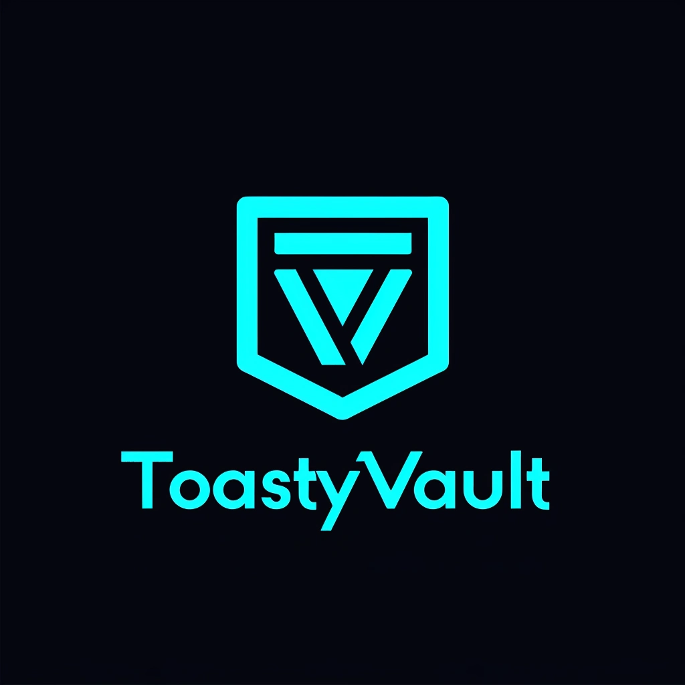

<a name="readme-top"></a>


<!-- PROJECT LOGO -->
<br />
<div align="center">
  <a href="https://github.com/Eric-Lighthall/ToastyVault">
    
  </a>

<h3 align="center">ToastyVault</h3>

  <p align="center">
    Unlock today's Best Deals: ToastyVault
    <br>
    <br>
    <a href="https://toastyvault.netlify.app/" target="_blank">Live Site</a>
    ·
    <a href="https://github.com/Eric-Lighthall/ToastyVault/issues/new?labels=bug&template=bug-report---.md">Report Bug</a>
    ·
    <a href="https://github.com/Eric-Lighthall/ToastyVault/issues/new?labels=enhancement&template=feature-request---.md">Request Feature</a>
  </p>
</div>


<!-- ABOUT THE PROJECT -->
## About The Project

Toasty Vault is a static website that aggregates video game deals using Vanilla JavaScript and the CheapShark API. It offers real-time updates, advanced search filters, and a user-friendly interface.

### Built With

* [![Javascript][Javascript]][Javascript-url]
* [![HTML5][HTML5]][HTML-url]
* [![CSS3][CSS3]][CSS-url]


<!-- GETTING STARTED -->
## Getting Started

You can access ToastyVault on <a href="https://toastyvault.netlify.app/" target="_blank">toastyvault.netlify.app</a> or if you prefer, get a local copy up and running by following these simple example steps.

### Local Development

1. Clone the repo
   ```bash
   git clone https://github.com/Eric-Lighthall/goblin-stocks.git
   ```
2. Open index.html

No extra setup is required as there's no server-side to handle.
<br>


<!-- CONTRIBUTING -->
## Contributing

Contributions are what makes the open-source community such an amazing place to learn, inspire, and create. Any contributions you make are **greatly appreciated**.

If you have a suggestion that would make this better, please fork the repo and create a pull request. You can also simply open an issue with the tag "enhancement".

1. Fork the Project
2. Create your Feature Branch (`git checkout -b feature/AwesomeFeature`)
3. Commit your Changes (`git commit -m 'Add some AwesomeFeature'`)
4. Push to the Branch (`git push origin feature/AwesomeFeature`)
5. Open a Pull Request


<!-- LICENSE -->
## License

Distributed under the MIT License. See `LICENSE.txt` for more information.


<!-- CONTACT -->
## Contact

[@EricLighthall](https://twitter.com/EricLighthall) - ericlighthall2@gmail.com

[https://github.com/Eric-Lighthall/goblin-stocks](https://github.com/Eric-Lighthall/goblin-stocks)
<br>
<p align="center"><a href="#readme-top">back to top</a></p>


<!-- MARKDOWN LINKS & IMAGES -->
[Javascript]: https://img.shields.io/badge/JavaScript-F7DF1E?style=for-the-badge&logo=javascript&logoColor=black
[Javascript-url]: https://www.javascript.com/
[HTML5]: https://img.shields.io/badge/HTML-239120?style=for-the-badge&logo=html5&logoColor=white
[HTML-url]: https://html5.org/
[CSS3]: https://img.shields.io/badge/CSS3-1572B6?style=for-the-badge&logo=css3&logoColor=white
[CSS-url]: https://angular.io/
